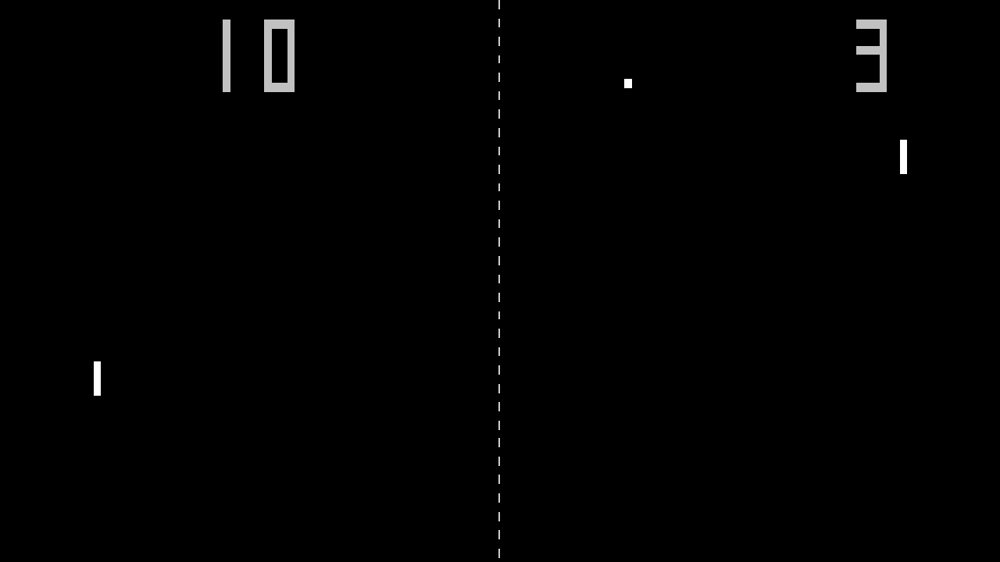

# Retrodot Pong
A modern implementation of the 1972 original Atari/Syzygy Pong made in Godot 3.5.2.

Note since Retrodot Pong is modeled on the original, it is FAST and takes a short while to get used to (it is called a twitch game for a reason).

## Features
Fullscreen by default, ball reflection angles adjusted for wide screens (16:9);
Ability to switch active screen;
Attract mode;
Keyboard controls.

## Controls
- SPACE - Start game;
- W/S - Player 1 controls;
- UP/DOWN - Player 2 controls;
- M - Mute sound;
- TAB - Change active screen if you are on a multi-monitor setup;
- F11 - Toggle windowed mode;
- ESC - Exit game.

## Notes
The fact that the paddles can't reach the top or bottom of the screen is a feature, not a bug.
I wanted to get the game out so I didn't spend much time refactoring code.
This will change as I go along.
